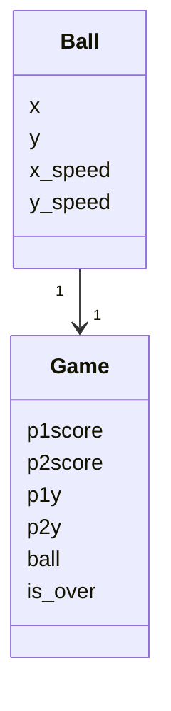
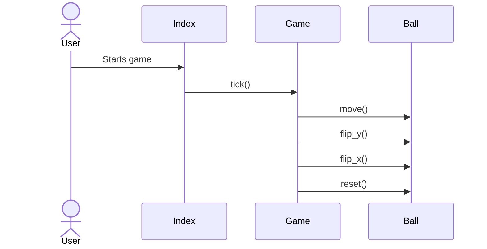

## Luokkakaavio

## Pelin etenemisen sekvenssikaavio

Pelin käynnistyessä suoritetaan Index-luokan main-metodi alustaa tarvittavat muuttujat, ja aloittaa while-silmukan suorituksen,
jossa kutsutaan jatkuvasti Game-olion tick-metodia ja pelin osat piirretään ruudulle Game-olion tietojen perusteella.
Pallon osuessa "kattoon" tai "lattiaan" kutsutaan pallon flip_y-metodia, pallon osuesssa mailaan taas kutsutaan flip_x-metodia.
Kun toinen pelaajista tekee maalin, kutsutaan Game-olion reset-metodia.
