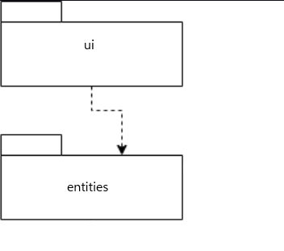
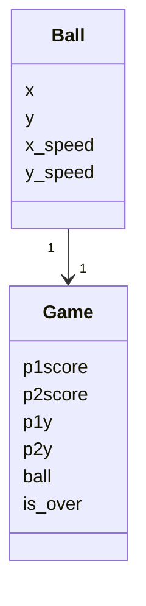
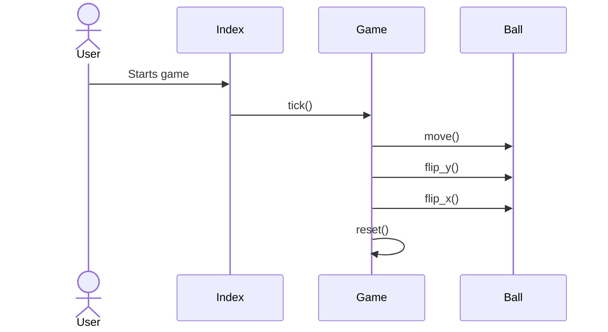

## Rakenne

Pakkaus ui sisältää käyttöjärjestelmästä vastaavan luokan, kun taas pakkaus entities sisältää sovelluksen tietokohteina käytettyjä luokkia.

## Sovelluslogiikka

Pallon tilasta vastaa Ball-luokan olio, joka säilyttää pallon koordinaatit ja nopeudet x- ja y-akseleilla. 
Sillä on metodit pallon nopeuksien kääntämiseen, sekä move-metodin, joka liikuttaa palloa nopeuksien mukaan.

Pelin tilasta vastaa Game-luokan olio, joka sisältää pelin oleelliset tietod (kuten pisteet, pelaajien sijainnit ja pelialueen koon).
Tämän lisäksi oliolla on tick-metodi, joka liikuttaa peliä eteenpäin, tarvittaessa vaihtaen pallon suuntaa, ja reset-metodi, 
jonka avulla peli alustetaan uudelleen maalin jälkeen.

## Tietojen pysyväistallennus

Minkään tiedon tallentaminen pysyvästi ei ole tarpeellista Pongin toiminnan kannalta, joten pysyväistallennusta ei ole.

## Pelin etenemisen sekvenssikaavio

Pelin käynnistyessä suoritetaan Index-luokan main-metodi alustaa tarvittavat muuttujat, ja aloittaa while-silmukan suorituksen,
jossa kutsutaan jatkuvasti Game-olion tick-metodia ja pelin osat piirretään ruudulle Game-olion tietojen perusteella.
Pallon osuessa "kattoon" tai "lattiaan" kutsutaan pallon flip_y-metodia, pallon osuesssa mailaan taas kutsutaan flip_x-metodia.
Kun toinen pelaajista tekee maalin, kutsutaan Game-olion reset-metodia.

