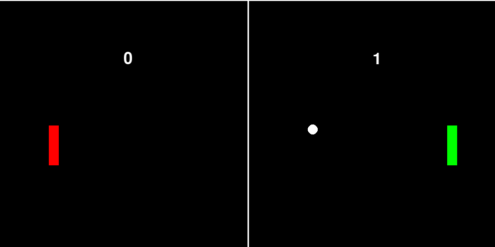

# Vaatimusmäärittely

## Sovelluksen tarkoitus
  Sovellukseni on PONG-peli. Pelin voi käynnistää ja pelin loputtua käynnistää uudelleen. 
  Sitä pelataan yhdellä näppäimistöllä ja molempia pelaajia on liikutettava itse.
  
## Käyttäjät
  Pelillä on vain yksi käyttäjärooli eli normaali käyttäjä. 
  Käyttäjiä on kuitenkin ihanteellisessa tilanteessa kaksi, sillä peli on tarkoitettu pelattavaksi kahdestaan.

## Käyttöliittymäesimerkki

## Toiminnallisuus
  Peli näyttää tavalliselta PONG-peliltä. 
  Pallo liikkuu pelialueella laidasta laitaan ja mailat liikkuvat pystysuunnassa.
  Pallon osuessa mailaan se vaihtaa suuntaa. 
  Pallon liikkeen kulma vaihtuu sen mukaan, millä kohdalla mailaa siihen osuttiin.
  Jos pallo menee ohi mailasta saa toinen palaaja maalin. 
  Pelaaja, joka saa ensin 10 maalia voittaa.
  Pelin pystyy käynnistämään uudelleen tai sulkemaan sulkemalla ikkunan.
